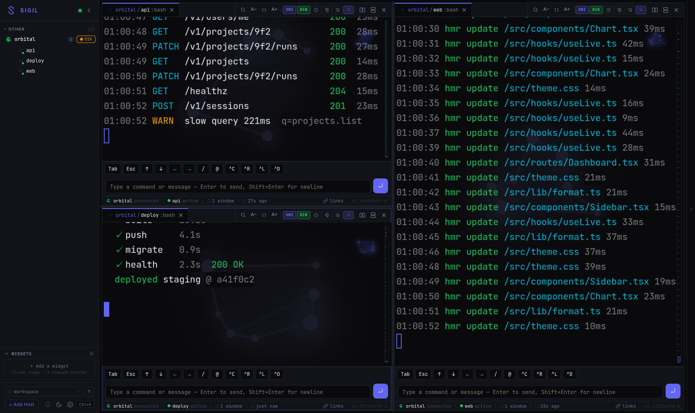

# Sigil

**A self-hosted hub for your terminal sessions.** Sigil SSHes into your machines,
attaches to `tmux`, and serves every session as a fast, persistent web terminal —
one browser tab for your whole fleet, on desktop or phone.

It is a single Go daemon (`sigild`) plus a React/xterm.js web client. Point it at
your hosts, open the web UI, and your named tmux sessions are all there:
reconnect-safe, searchable, with live host metrics and reactive output triggers.



> ⚠️ **Trust model:** sigild holds SSH access to every host you configure and a
> bearer token gates the web UI. Run it on a trusted network (LAN / VPN /
> Tailscale) or behind a TLS-terminating reverse proxy. See [SECURITY.md](SECURITY.md).

## Features

- **Session hub** — discovers and attaches to `tmux` sessions across many hosts;
  auto-resurrects named sessions after a tmux/host restart.
- **Persistent web terminal** — xterm.js with replay-then-live reconnect, so a
  dropped connection resumes exactly where it left off (no lost output).
- **Unified scrollback** — reflow-capable history that copies as logical lines
  (no hard-wrapped line breaks) and linkifies URLs; works while scrolled.
- **Tiling + tabs** — split panes (react-mosaic), tabbed sessions, and a
  thumb-friendly mobile layout (bottom session strip, swipe to switch, PWA).
- **Live host metrics** — CPU / load / memory (PSI-aware) / disk / net /
  top processes per host, collected over SSH.
- **Triggers** — fire an effect when a session's output matches a regex:
  on-screen flash, background tint, an audio beep, a toast, or an HMAC webhook.
- **Files & media** — browse/upload (drag-drop) files, inline image preview,
  host↔host transfer, and "insert path into the focused terminal".
- **Search** — full-text search across captured scrollback (SQLite FTS5).

## Quick start

Requires **Go 1.22+** and **Node 18+** (to build the web client).

```bash
git clone <this-repo> sigil && cd sigil

# 1. Create a config from the template and edit it (hosts + a bearer token)
make setup-config
$EDITOR ~/.config/sigil/config.toml     # set tokens=[...] and your [[hosts]]

# 2. Build the web client and the daemon
make build-web
make build            # produces dist/sigild and dist/sigil-web

# 3. Run
./dist/sigild --config ~/.config/sigil/config.toml   # hub  :7778
./dist/sigil-web -dir ./web/dist -backend http://127.0.0.1:7778  # UI :7777
```

Open the web UI (default `http://localhost:7777`), paste your token, and your
sessions appear. `sigild` serves the API (default `:7778`); `sigil-web` serves
the static web client (`:7777`).

### Something not working?

```bash
sigil doctor          # what's wrong, and what to do about it
sigil doctor --json   # same, machine-readable (for scripts or an LLM agent)
```

### Documentation

| Doc | What it covers |
|---|---|
| [docs/SETUP.md](docs/SETUP.md) | Full first-run guide: build → configure → add a host → verify, with the failures that actually happen. |
| [docs/CONFIGURATION.md](docs/CONFIGURATION.md) | Every config key, with the real defaults and what each one costs you. |
| [docs/API.md](docs/API.md) | HTTP API, WebSocket, and SSE reference. |
| [SECURITY.md](SECURITY.md) | Trust model and reporting. Read before exposing the hub. |

### Configuration

Everything lives in one TOML file (see [`config.example.toml`](config.example.toml)):

| Key | Purpose |
|---|---|
| `hub.listen_addr` | Bind address for the web/API (default `0.0.0.0:7777`). |
| `hub.auth.tokens` | Bearer tokens accepted by the API and WebSocket. |
| `hub.host_key_mode` | SSH host-key policy: `tofu` (default), `strict`, `insecure`. |
| `hub.allowed_origins` | WebSocket Origin allowlist (empty = permissive; token still required). |
| `hub.scrollback` | Capture + retention (also editable live in Settings → Storage). |
| `[[hosts]]` | Each SSH host: name, hostname, port, user, auth, tags, auto_connect. |

## sigil

A fast **terminal client** for the fleet. `sigil` is a small multi-view TUI over
a running `sigild`: a branded **Home** with a live fleet summary, a **Sessions**
view with full CRUD, a **Hosts** view, and a toggleable **resource sidebar**. To
open a session it hands the terminal to native `ssh -t … tmux attach`, so you get
real tmux with zero rendering on our side — a navigator, not a second terminal.

```bash
make build-cli        # produces dist/sigil

# point it at a hub (flag > env > default http://127.0.0.1:7778)
./dist/sigil --server http://sigil-host.local:7778 --token "$SIGIL_TOKEN"

# or via environment
export SIGIL_SERVER=http://sigil-host.local:7778
export SIGIL_TOKEN=…      # the same bearer token the web UI uses
./dist/sigil
```

Config resolves **flag > env (`SIGIL_SERVER` / `SIGIL_TOKEN`) > `~/.config/sigil/tui.toml` > default**.
A missing or rejected token shows a clear error panel with the status code — not a crash.
Hosts/sessions/metrics refresh silently every few seconds, so activity glyphs and
the resource meters stay live without a keypress.

**Navigation:** `tab` / `shift-tab` cycle views · `1` `2` `3` jump to Home / Sessions / Hosts ·
`s` toggle the resource sidebar · `r` refresh · `?` help · `q` / `ctrl-c` quit.

**Sessions:** `↑/↓` (`j/k`) move · `g` / `G` top / bottom · `/` fuzzy filter ·
`enter` attach (suspends the TUI; `ssh`+`tmux` own the terminal, resumes on detach) ·
`n` new · `x` kill (confirm) · `R` rename.

**Hosts:** `enter` view that host's sessions · `c` / `d` connect / disconnect ·
`n` new session on the highlighted host.

**Signals** (the coloured glyph on each session): ● working · ◆ needs you ·
● connected · ○ idle. The sidebar meters grade cpu / mem / disk green → amber → red.

## Architecture

```
browser ──HTTP/WS──► sigil-web (static)      sigild (Go daemon)
                          │                    ├── SSH pool ──► your hosts (tmux)
                          └──── API/WS ───────►├── session manager (attach, replay ring)
                                               ├── scrollback engine (SQLite + FTS5)
                                               ├── metrics collector (per-host probes)
                                               └── event bus (triggers → webhooks/UI)
```

See [`docs/ARCHITECTURE.md`](docs/ARCHITECTURE.md) for the full picture and
[`docs/OSS_ROADMAP.md`](docs/OSS_ROADMAP.md) for the hardening history.

## Development

```bash
make dev          # run sigild locally (API only)
make test         # Go unit tests
cd web && npm test        # frontend unit tests (vitest)
cd web && npm run lint    # eslint + the no-raw-hex colour guard
```

See [CONTRIBUTING.md](CONTRIBUTING.md).

## License

[MIT](LICENSE) © 2026 Michael Gifford-Santos
